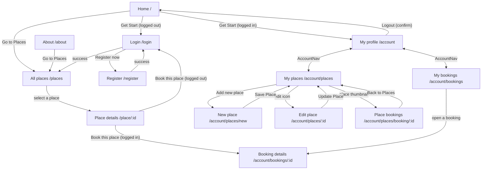

# StayEase — Frontend

StayEase is an accommodation booking platform built on the MERN stack (MongoDB, Express, React, Node.js). Hosts list places to stay, and guests browse those places and book them.

This repository contains the **web client**: a single-page application built with React and Vite and styled with Tailwind CSS. All data comes from the StayEase REST API, which lives in a separate repository: [hotel-booking-backend](https://github.com/ShamilKaleel/hotel-booking-backend).

---

## Table of Contents

- [Features](#features)
- [Tech Stack](#tech-stack)
- [Architecture](#architecture)
- [Pages and Routes](#pages-and-routes)
- [UI Flow and Navigation](#ui-flow-and-navigation)
- [Project Structure](#project-structure)
- [Main Components](#main-components)
- [Getting Started](#getting-started)
- [Deployment](#deployment)
- [Known Limitations](#known-limitations)

---

## Features

**Browsing**
- **Landing page:** a hero section, a "Services" section and an "About" section.
- **All places (`/places`):** every listing in a responsive grid, showing the cover photo, address, title and price per night.
  - A search box filters the list by address as you type. Filtering happens in the browser.
- **Place details page:**
  - A photo gallery with three photos in a grid and a full-screen "Show more photos" view.
  - The address links to Google Maps.
  - Description, check-in/check-out times, maximum number of guests and extra info.

**Accounts**
- Register with name, email and password, then log in.
- The session is restored when the app loads, by calling `GET /profile` with the auth cookie.
- A profile page shows the logged-in user. Logging out asks for confirmation first.
- Toast notifications report whether login and registration succeeded or failed.

**Booking a place**
- A booking widget on every place page offers check-in/check-out date pickers, a number of guests, the guest's full name (filled in from the logged-in user) and a phone number.
- The total price updates as you pick dates: number of nights × price per night.
- Before submitting, it checks that the dates are valid and that every field is filled in. Problems show as toast messages.
- Logged-out users are sent to the login page. After booking, the user lands on the booking details page.

**My bookings**
- A list of your bookings, each with the place photo, the dates, the number of nights and the total price.
- A booking details page with the place title, a map link, the dates, the total price and the photo gallery.
- Cancel a booking. You're asked to confirm first.

**Hosting (my places)**
- A list of the places you own.
- A form to add or edit a place with these fields:
  - title, address and description
  - photos
  - perks: Wifi, Free parking spot, TV, Radio, Pets and Private entrance
  - extra info and check-in/check-out times
  - maximum guests and price per night
- **Photo manager:**
  - Upload several images; each one uploads separately with its own progress indicator and status.
  - Retry a failed upload.
  - Set any photo as the main (cover) photo.
  - Remove a photo, which also deletes it from storage straight away.
- Delete a place. You're asked to confirm first.
- See the bookings for each of your places in a table: guest name, phone, check-in, check-out, guests and price.

**Layout**
- A fixed, responsive header.
  - On mobile it collapses into a hamburger menu.
  - On the home page it's transparent until you scroll.
  - It shows the logged-in user's name.
- A shared footer on every page.

---

## Tech Stack

| Category | Technology | Version | Used for |
| --- | --- | --- | --- |
| UI library | [React](https://react.dev/) / React DOM | 18.2.0 | Components and rendering |
| Routing | [React Router DOM](https://reactrouter.com/) | 6.6.2 | Client-side routing (`BrowserRouter`, nested routes, `Navigate`) |
| Build tool | [Vite](https://vitejs.dev/) + `@vitejs/plugin-react` | 4.0.4 / 3.0.1 | Dev server, production build, `import.meta.env` variables |
| Styling | [Tailwind CSS](https://tailwindcss.com/) | 3.2.4 | Utility-first styling with a custom colour theme |
| CSS tooling | PostCSS / Autoprefixer | 8.4.21 / 10.4.13 | Running Tailwind and adding vendor prefixes |
| HTTP client | [Axios](https://axios-http.com/) | 1.2.2 | API requests, sending cookies, upload progress |
| Dates | [date-fns](https://date-fns.org/) | 2.29.3 | Counting nights (`differenceInCalendarDays`) and formatting dates |
| Notifications | [react-toastify](https://fkhadra.github.io/react-toastify/) | 10.0.5 | Toast messages |
| Icons | [Ionicons](https://ionic.io/ionicons) (CDN) | 7.1.0 | `<ion-icon>` web components, loaded in `index.html` |
| Font | [Lexend](https://fonts.google.com/specimen/Lexend) (Google Fonts) | — | App-wide typeface, loaded in `index.html` |
| Deployment | [Vercel](https://vercel.com/) | — | Hosting, with an SPA rewrite in `vercel.json` |

npm package versions come from `yarn.lock`. Ionicons and Lexend are loaded from CDNs in `index.html`. There's also a set of inline SVG icons used throughout the components.

**Installed but not used.** `package.json` also lists `framer-motion`, `react-hot-toast` and `@radix-ui/react-icons`, but no source file imports them. `react-infinite-logo-slider` is imported only by `InfinitySlider`, and that component is never rendered.

---

## Architecture

StayEase's frontend is a client-rendered single-page application. It has no server-side rendering and no global state library. Shared state is held in one React Context; everything else is local component state.

```
main.jsx
└── <React.StrictMode>
    └── <UserContextProvider>          # Holds the logged-in user; calls GET /profile on load
        └── <BrowserRouter>
            └── <App>                  # Axios defaults, <Routes>, <ToastContainer>
                └── <Layout>           # <Header> + <Outlet> + <Footer>
                    └── <Page />       # The component for the current route
```

### Key parts

- **API client (`src/App.jsx`)**
  - Axios is configured once for the whole app.
  - `axios.defaults.baseURL` comes from `VITE_API_BASE_URL`.
  - `axios.defaults.withCredentials = true`, so the backend's `httpOnly` auth cookie goes with every request.
  - Components call Axios directly with relative paths such as `axios.get("/places")`. There's no separate service layer.
- **Authentication state (`src/context/UserContext.jsx`)**
  - Provides `user`, `setUser` and `ready`. `ready` becomes `true` once the initial `GET /profile` call has finished, whether it succeeded or failed.
  - `LoginPage` calls `setUser` after a successful login, and `ProfilePage` clears the user on logout.
  - Components read the context to decide what to show: the header's Login button or the user's name, where the hero button links, and whether the booking widget sends you to the login page first.
- **Data fetching**
  - Each page fetches its own data in `useEffect` and keeps the loading, error and data state locally with `useState`.
  - While loading, pages show `Lording`, a bouncing-dots indicator.
- **Styling**
  - The Tailwind theme in `tailwind.config.cjs` adds custom colours and the `lexend` font family:
    - `primary` `#cbf901`
    - `secondry` `#1C1C1C`
    - `fifth` `#B3B3B3`
    - and a few others
  - `src/index.css` sets up the dark theme with white text on `bg-neutral-900`, plus shared form-input and `button.primary` styles and a few custom animations.

### Backend endpoints used

| Feature | Request | Called from |
| --- | --- | --- |
| Restore session | `GET /profile` | `UserContext` |
| Register / log in / log out | `POST /register`, `POST /login`, `POST /logout` | `RegisterPage`, `LoginPage`, `ProfilePage` |
| List all places | `GET /places` | `AllPalcesPage` |
| Place details | `GET /places/:id` | `PlacePage`, `PlacesFormPage` (edit), `PlaceBookingsPage` |
| My places | `GET /user-places` | `PlacesPage` |
| Create / update a place | `POST /places`, `PUT /places` | `PlacesFormPage` |
| Delete a place | `DELETE /places/:id` | `PlacesPage` |
| Upload / remove a photo | `POST /upload`, `DELETE /places/image/:file` | `EnhancedPhotosUploader` |
| Create a booking | `POST /bookings` | `BookingWidget` |
| My bookings / one booking | `GET /bookings` | `BookingsPage`, `BookingPage` |
| Cancel a booking | `DELETE /bookings/:id` | `BookingsPage` |
| Bookings for a place | `GET /bookings/place/:placeId` | `PlaceBookingsPage` |

All paths are relative to `VITE_API_BASE_URL`. See the [backend README](https://github.com/ShamilKaleel/hotel-booking-backend) for request and response details.

---

## Pages and Routes

Every route sits inside `Layout`, so every page gets the shared header and footer. Routes are defined in `src/App.jsx`.

| Route | Page component | Login needed | Description |
| --- | --- | --- | --- |
| `/` | `IndexPage` | No | Landing page: hero, services and about sections |
| `/about` | `AboutPage` | No | About StayEase, with a "Go to Places" button |
| `/places` | `AllPalcesPage` | No | Grid of all places, with an address search |
| `/place/:id` | `PlacePage` | No (booking requires it) | Place details, gallery and booking widget |
| `/login` | `LoginPage` | No | Login form. Goes to `/places` on success. |
| `/register` | `RegisterPage` | No | Registration form. Goes to `/login` on success. |
| `/account` | `ProfilePage` | Yes, redirects to `/login` | Profile info and logout |
| `/account/bookings` | `BookingsPage` | Yes, via the API* | Your bookings, with cancel |
| `/account/bookings/:id` | `BookingPage` | Yes, via the API* | Details of one booking |
| `/account/places` | `PlacesPage` | Yes, via the API* | Your listings, with add, edit, delete and view bookings |
| `/account/places/new` | `PlacesFormPage` | Yes, via the API* | Create a place |
| `/account/places/:id` | `PlacesFormPage` | Yes, via the API* | Edit a place |
| `/account/places/booking/:id` | `PlaceBookingsPage` | Yes, via the API* | Bookings table for one of your places |

\* Only `/account` redirects logged-out visitors on the client side. The redirect logic for the other account routes is commented out in `App.jsx`, so those pages render, and their API calls then fail with `401 Unauthorized`.

---

## UI Flow and Navigation

**The header is on every page.** It links to **Home** (`/`), **Places** (`/places`) and **About** (`/about`), plus either a **Login** button or, when you're logged in, a button showing your name that goes to `/account`. Inside the account area, the **AccountNav** tabs switch between **My profile**, **My bookings** and **My places**.



### Typical journeys

1. **Guest booking a stay:**
   1. Open **Places** and search by address if needed.
   2. Open a place and choose check-in and check-out dates. The name and phone fields appear once valid dates are picked.
   3. Click **Book this place**. You're redirected to the booking details page.
   4. Find the booking later under **My bookings**, where you can cancel it.
2. **Host listing a place:**
   1. Go to **My places** and click **Add new place**.
   2. Fill in the form, upload photos and choose a cover photo.
   3. Save. You're returned to **My places**.
   4. Click a place's thumbnail to see who has booked it, or use the edit and delete icons to manage it.
3. **New user:**
   1. Go to **Register**. On success a toast appears and you're sent to **Login**.
   2. On a successful login you're sent to **Places**.

---

## Project Structure

```
hotel-booking-frontend/
├── public/
│   └── vite.svg
├── src/
│   ├── assets/
│   │   ├── icons/                 # SVG icons + index.js that re-exports them
│   │   ├── Frame 29.png           # About section image
│   │   ├── modern-apartment-…jpg  # Hero background image
│   │   └── react.svg              # Favicon
│   ├── components/                # Reusable UI components (see below)
│   ├── constants/
│   │   └── index.js               # Content for the "Services" section cards
│   ├── context/
│   │   └── UserContext.jsx        # Logged-in user state + session restore
│   ├── pages/                     # One component per route (see Pages and Routes)
│   ├── App.jsx                    # Axios defaults, route table, ToastContainer
│   ├── Layout.jsx                 # Header + routed page + Footer
│   ├── main.jsx                   # Entry point: providers and router
│   └── index.css                  # Tailwind directives and global styles
├── index.html                     # HTML shell: title, Lexend font, Ionicons scripts
├── tailwind.config.cjs            # Tailwind content paths, custom colours and font
├── postcss.config.cjs             # Tailwind + Autoprefixer
├── vite.config.js                 # Vite with the React plugin
├── vercel.json                    # Rewrites every path to / for client-side routing
├── package.json                   # Scripts and dependencies
└── yarn.lock                      # Locked dependency versions (Yarn v1)
```

Note the spelling of two file names: the all-places page is `AllPalcesPage.jsx`, and the loading indicator is `Lording.jsx`.

---

## Main Components

**Layout and navigation**

| Component | Purpose |
| --- | --- |
| `Header` | Fixed responsive navbar with the logo, links, a Login button or user button, and a mobile hamburger menu. It's transparent on the home page until you scroll. |
| `Footer` | Site footer with static headquarters, contact, social and quick-link text |
| `AccountNav` | Tabs for My profile, My bookings and My places. The active tab is worked out from the URL. |

**Landing page**

| Component | Purpose |
| --- | --- |
| `Hero` | Full-screen hero image with animated headline text and a "Get Start" button |
| `Services` / `ServiceCard` | Three animated service cards, filled from `constants/index.js` |

**Places and bookings**

| Component | Purpose |
| --- | --- |
| `PlaceGallery` | Three-photo grid with a full-screen view of all photos |
| `PlaceImg` | Shows one photo of a place (the cover photo by default) |
| `Image` | `` wrapper. Any source that doesn't contain `https://` gets `http://localhost:4000/uploads/` added in front. |
| `AddressLink` | Shows an address as a Google Maps search link that opens in a new tab |
| `BookingWidget` | Booking form with dates, guests, name and phone. Calculates the price, validates input and creates the booking. |
| `BookingDates` | Shows the number of nights and the check-in → check-out dates |
| `Perks` | Six checkboxes for choosing a place's perks |

**Photo upload**

| Component | Purpose |
| --- | --- |
| `EnhancedPhotosUploader` | Photo manager in the place form. It uploads each file in its own request and tracks progress. It also handles retrying, removing a photo and setting the main photo. |
| `ImageUploadCard` | Thumbnail card showing a "Main" badge, the set-as-main and remove buttons, and progress or error states |
| `UploadStatusBadge` | One row in the upload queue: file name, size, status and a retry button |
| `ProgressRing` | Animated circular progress indicator |

**Feedback**

| Component | Purpose |
| --- | --- |
| `Lording` | Loading indicator with bouncing dots |

**Not used anywhere in the app**

These files exist but are never rendered:
- `pages/HomePage.jsx`
- `components/PhotosUploader.jsx` (an older uploader)
- `components/InfinitySlider.jsx`
- `components/Card.jsx`
- `components/Test.jsx`
- the skeleton exports in `components/ImageUploadSkeleton.jsx`

---

## Getting Started

### Prerequisites

- **Node.js 16 or newer.** Vite 4 needs Node 14.18+ or 16+.
- **Yarn 1.x** (the repository includes a `yarn.lock`), or npm.
- **A running StayEase backend.** Follow the setup in the [backend README](https://github.com/ShamilKaleel/hotel-booking-backend). By default it listens on `http://localhost:4000`.

### 1. Clone and install

```bash
git clone https://github.com/ShamilKaleel/hotel-booking-frontend.git
cd hotel-booking-frontend
yarn install        # or: npm install
```

### 2. Configure environment variables

Create a `.env` file in the project root. It's git-ignored.

```env
VITE_API_BASE_URL=http://localhost:4000/api
VITE_AWS_BUCKET_NAME=your-bucket-name
```

| Variable | Required | Description |
| --- | --- | --- |
| `VITE_API_BASE_URL` | Yes | Base URL of the backend API, **including the `/api` prefix**. Every request path, such as `/places`, is added after it. |
| `VITE_AWS_BUCKET_NAME` | Yes, to remove photos | The S3 bucket name. It must match the backend's `AWS_BUCKET_NAMEE`. The photo manager uses it to get the S3 object key out of a photo URL when you remove a photo. |

Vite only exposes variables that start with `VITE_`, and it reads them when the dev server starts or the app is built. Restart `yarn dev` after you change `.env`.

### 3. Point the backend at the frontend

The backend only accepts credentialed requests from the origin in its `ALL_CORS_ORIGINS` variable. For local development, set this in the **backend's** `.env`:

```env
ALL_CORS_ORIGINS=http://localhost:5173
```

Use `localhost` for both apps rather than `127.0.0.1` or a LAN IP. The CORS origin has to match exactly, and the backend's `Secure`, `SameSite=None` auth cookie is only accepted on `localhost` or over HTTPS.

### 4. Run the development server

```bash
yarn dev            # or: npm run dev
```

Open the URL Vite prints, which is `http://localhost:5173` by default.

### Available scripts

| Script | Command | Description |
| --- | --- | --- |
| `dev` | `vite` | Start the dev server with hot module replacement |
| `build` | `vite build` | Create a production build in `dist/` |
| `preview` | `vite preview` | Serve the production build locally |

---

## Deployment

The project is set up for [Vercel](https://vercel.com/):

- **SPA rewrite.** `vercel.json` rewrites every path (`/(.*)`) to `/`. Client-side routes such as `/place/123` therefore still work when the page is refreshed or opened directly.
- **Environment variables.** Set `VITE_API_BASE_URL`, pointing at the deployed backend with `/api` on the end, and `VITE_AWS_BUCKET_NAME` in the Vercel project settings. Vite puts these values into the bundle at build time, so you need to redeploy after changing them.
- **Backend CORS.** Set the backend's `ALL_CORS_ORIGINS` to the deployed frontend URL.

---

## Known Limitations

These describe how the code currently behaves.

- **Missing login redirects.** Only `/account` sends logged-out users to the login page. The other `/account/*` pages render anyway and fail on their API calls. For example, **My bookings** just shows "No bookings", and **My places** shows a `401` error message.
- **Number of guests isn't saved.** The booking widget sends the number of guests, but the backend doesn't store it. The "Guests" column on the place-bookings page therefore always shows `N/A`.
- **No guest limit.** The guest count isn't checked against the place's maximum guests.
- **Booking details fetch.** The booking details page loads all of the user's bookings and picks the matching one in the browser, because the API has no endpoint for a single booking.
- **Photo removal is immediate.** Removing a photo in the place form deletes it from S3 straight away, even if you then leave without saving.
- **Hardcoded development URL.** `Image` puts `http://localhost:4000/uploads/` in front of any image source that doesn't contain `https://`.
- **Basic search.** The search on `/places` matches the address only, and it filters the already-loaded list in the browser.
- **Static content.** The footer, the Services section and the About section are static text. There's no working newsletter signup or contact form.
- **Unused code.** There are unused files and dependencies, listed under [Main Components](#main-components) and [Tech Stack](#tech-stack).
- **No tests or linting.** The project has no automated tests and no linting set up.
